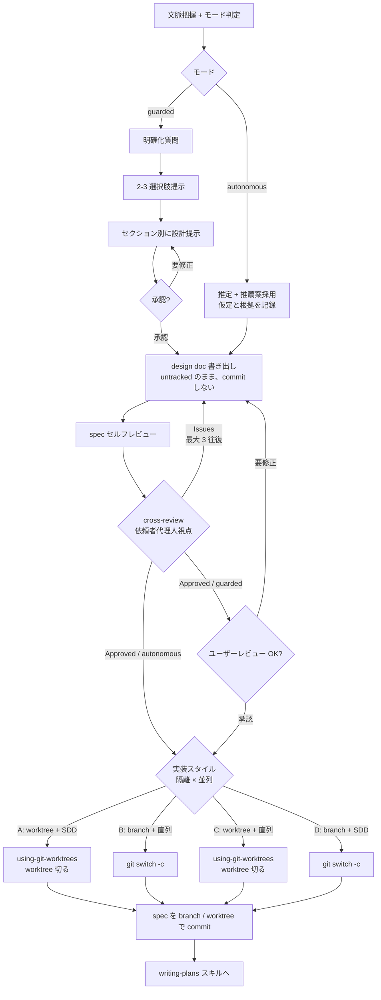

# brainstorming — アイデアを設計に落とす

要件 → 設計の対話を強制する。実装着手前に「何を作るか」と「受け入れ条件」を確定し、design doc を書き出し → 実装スタイル決定 → branch / worktree を切ってから commit するまでがゴール。**main / 既定 branch に直 commit してはいけない** (design doc も対象。PJ CLAUDE.md / グローバルルールに「main 直コミット禁止」が定義されていればそれに従う)。

**着手の合図:** `brainstorming スキルで設計を詰めます。モード: <autonomous|guarded> (根拠: ...)` と 1 行宣言してから始める。

## モード (autonomous / guarded)

着手時に `cross-review` スキル (`~/.claude/skills/cross-review/SKILL.md`) の「モード判定」でモードを決める。**既定は Auto Mode 有効なら autonomous、それ以外は guarded**。ユーザーの「慎重に」「おまかせ」等の発話、PJ の `.claude/rules/autonomy.md`、リスク昇格リストがそれより優先する。

- **guarded**: 本スキルの従来フロー通り、各ゲートでユーザー承認を取る。ただし spec はユーザーに見せる前に cross-review ゲートを通しておく
- **autonomous**: ユーザー承認ゲートを **cross-review ゲート (別 Claude モデル + 視点指示)** に置き換え、質問で止まらず spec 確定 → branch 切り出し → writing-plans まで進む。以下、各ステップの「autonomous では」注記に従う

<HARD-GATE>
design doc を書いて **承認** されるまで、いかなる実装スキルも呼び出さない / コードも書かない / プロジェクト scaffolding もしない。「簡単そうだから」は例外にならない。承認者は guarded ではユーザー、autonomous では cross-review ゲート (Approved) 。
</HARD-GATE>

## アンチパターン: 「これは単純だから設計は不要」

todo リストでも 1 関数のユーティリティでも config 変更でも、全て設計を通す。「単純」案件こそ無検証の前提が後でツケになる。設計は短くてよい (本当に単純なら数行で OK)。**ただし承認は取る** (guarded はユーザー、autonomous は cross-review)。

## チェックリスト

順に TaskCreate でタスク化し、消化していく。

1. **プロジェクト文脈の把握 + モード判定** — 既存ファイル / docs / 直近 commit を確認し、cross-review の基準でモードを決めて宣言
2. **視覚補助の必要性を都度判定** — 「文章より図で見せた方が分かる」質問が出たときだけ視覚補助を出す。最初から提案しない。詳細は `visual-companion.md` 参照 (autonomous では skip)
3. **明確化質問** — 一度に 1 つ。目的 / 制約 / 成功基準 を引き出す。**autonomous では質問せず**、文脈から推定して「仮定と根拠」に書く
4. **2〜3 の選択肢提示** — トレードオフ込み、推薦付き。**autonomous では推薦案を採用**し、不採用案と理由を spec に残す
5. **設計提示** — セクションごとに承認を取りながら進める。**autonomous では提示を省略**し、step 6 で spec にまとめて書く
6. **design doc を書き出す (commit はまだしない)** — まず `ls docs/specs/ .claude/specs/ docs/ 2>/dev/null` で **既存 spec 配置を物理確認**。既存があればそれに揃え、無ければ `.claude/specs/YYYY-MM-DD-<topic>-design.md` を新規作成 (fallback)。**untracked のまま** 保存。**ここでは絶対に commit しない** (main 直コミット禁止)
7. **spec セルフレビュー** — placeholder / 矛盾 / 曖昧さ / スコープを内省的にチェック (詳細後述)
8. **cross-review ゲート (spec)** — 別 Claude モデルに「依頼者の代理人」視点でレビューさせる (両モード必須。手順は cross-review スキル、prompt は `spec-reviewer.md`)
9. **ユーザーレビュー** — guarded のみ。autonomous は step 8 の Approved をもって承認とする
10. **実装スタイル決定 + branch / worktree 切り出し** — 直交 2 軸 (隔離 × 並列) の 4 択から選び、branch / worktree を切る (詳細後述)。autonomous では機械的に決定
11. **spec を branch / worktree で commit** — step 6 で untracked にしていた spec を、切ったばかりの branch / worktree でステージして commit する
12. **writing-plans へ遷移** — 実装プラン作成スキルに引き継ぐ

## 進行フロー



**遷移先は writing-plans のみ**。他の実装系スキル (frontend-design, mcp-builder 等) は brainstorming からは直接呼ばない。

## プロセス詳細

### アイデア理解

- まず現状を見る (ファイル / docs / 直近 commit)
- 質問する前にスコープを見積もる。「chat + storage + billing + analytics をプラットフォーム化したい」のように複数の独立サブシステムを含む要望は **その場で指摘** する。1 つの spec に収まらない案件は decomposition が先
- 大きすぎる場合: サブプロジェクトに分解 → 各サブプロジェクトに対して [spec → plan → 実装] サイクルを 1 つずつ回す
- 適切なサイズなら **質問は一度に 1 つ**。選択肢があるなら multiple choice に。1 メッセージ 1 質問
- 焦点: 目的 / 制約 / 成功基準
- **autonomous では:** 質問の代わりに、コード / docs / user-journey / CLAUDE.md / 依頼文から答えを推定する。推定した内容は spec の `## 仮定と根拠` に「仮定 — 根拠 (ファイル / 依頼文の該当箇所)」の形で全て書く。根拠が見つからず、しかも間違えると不可逆な論点だけは cross-review の停止条件に従って止まる。スコープ過大で分解が必要な場合も、分解案を spec に書き、最初のサブプロジェクトだけを今回のスコープとして進める

### 選択肢提示

- 2〜3 通りの方向性 + それぞれのトレードオフ
- 推薦案を先頭、理由を添える
- **autonomous では:** 比較は spec の `## 検討した選択肢` に書き、推薦案を採用して進む (ユーザーに選ばせない)

### 設計提示

- 理解できたら段階的に設計を提示する
- 各セクションは内容量に合わせて伸縮させる。単純なら数文、複雑なら 200〜300 字
- 各セクション直後に「ここまで合ってますか?」を挟む
- カバーする観点: アーキテクチャ / コンポーネント / データフロー / エラーハンドリング / テスト方針
- ズレを感じたら戻って再質問する
- **autonomous では:** 段階提示を省略し、同じ観点を spec にまとめて書く

### 疎結合と明確さを設計に織り込む

- 1 つの責務 / well-defined interface / 単独で理解・テスト可能 な単位にシステムを分割する
- 各単位について「何をするか / どう使うか / 何に依存するか」を答えられるか確認する
- 内部を読まずに用途が分かるか? consumer を壊さず内部を変えられるか? 答えが No なら境界を見直す
- 小さく境界が明確なファイルは Claude にとっても扱いやすい (context に丸ごと載せられる)。大きく成長したファイルは「責務が多すぎる」サイン

### 既存コードベースで作業するとき

- 提案前に既存構造を眺めて従う
- 既存コードに「今回の仕事に影響する問題」がある場合は限定的な改善も設計に含める (良い developer が触れたコードをついでに直すように)
- 関係ないリファクタは混ぜない。今回のゴールに集中

## 設計後

### ドキュメント化 (commit はまだしない)

- 確定 spec を **untracked のまま** 書き出す。配置先は: ① `ls docs/specs/ .claude/specs/ docs/ 2>/dev/null` で **既存 spec ディレクトリを物理確認** → ② 既存があれば揃える、無ければ `.claude/specs/YYYY-MM-DD-<topic>-design.md` を新規作成 (default fallback)
- **この時点では絶対に commit しない**。「main 直コミット禁止」は design doc にも適用される (実装に入る前に必ず branch / worktree を切る)
- ファイルを書き出した時点で `git status` には untracked として現れる。spec セルフレビュー / ユーザーレビューはこの untracked ファイルに対して行う
- commit は step 11 (実装スタイル決定 + branch / worktree 切り出しの後) に行う

### spec セルフレビュー

書いた spec を新鮮な目で見直す:

1. **placeholder 走査:** `TBD` / `TODO` / 未完セクション / 曖昧要件 → その場で fix
2. **内部整合性:** セクション間に矛盾はないか? アーキテクチャと機能記述が噛み合っているか?
3. **スコープチェック:** 1 つの実装 plan に収まるか? 分解が必要なら戻る
4. **曖昧性チェック:** 2 通り解釈できる要件はないか? あれば 1 つに決める

問題を見つけたら直接書き換える。再レビューは不要、直して進む。

### cross-review ゲート (spec)

セルフレビュー後、**両モードで必須**。`cross-review` スキルの手順に従い、セッションとは異なる Claude モデルの subagent に `spec-reviewer.md` の prompt で「依頼者の代理人」視点のレビューをさせる。ユーザーの元の依頼文は要約せず逐語で渡す。

- `Issues Found` → 修正してから再レビュー (最大 3 往復)
- `Needs Human` / 収束しない場合 → cross-review の「ループ」節に従う (可逆なら安全側で進めて未決事項に記録、不可逆なら停止)
- autonomous では spec 末尾の `## 自律判断ログ` にモード・仮定・選択・レビュー結果を追記する

### ユーザーレビュー (guarded のみ)

autonomous では skip し、cross-review の Approved をもって承認とする。

guarded では cross-review 通過後、ユーザーに確認を求める:

> spec を `<path>` に書きました。実装プラン作成に進む前に確認をお願いします。

応答待ち。修正要求があれば直してセルフレビューに戻る。承認されたら次へ。cross-review の結果 (指摘と対応) も一緒に要約して見せると、ユーザーが確認に使える。

### 実装スタイル決定 + branch / worktree 切り出し

spec 承認後、writing-plans に進む **前** に実装スタイルを決める。後でひっくり返すと plan の前提 (タスク分割粒度 / 並列前提) が崩れるので、ここで確定させる。

直交 2 軸の組み合わせから 4 択:

- **隔離軸**: `worktree` (別ディレクトリで隔離) or `branch` (このセッションで branch だけ切る)
- **並列軸**: `SDD` (subagent-driven-development で並列) or `直列` (このセッションで私が順に実装)

guarded ではユーザーに以下を聞く (AskUserQuestion 必須。tool 利用不可な環境では markdown 表 + 番号付き選択肢で代替)。autonomous では聞かずに下記「autonomous での機械的決定」で決める:

- **A. worktree + SDD** — 隔離環境 × subagent 駆動。大規模 / 並列向け
- **B. branch + 直列** — branch のみ、このセッションで私が順に実装。小〜中規模 / 1 本道
- **C. worktree + 直列** — worktree で隔離して直列、subagent なし
- **D. branch + SDD** — branch のみ、このセッションで SDD

#### 軸ごとの判断材料

**隔離 (worktree) を選ぶとき:**
- main で別ブランチ作業を並行で走らせたい (worktree なら作業ツリーが独立)
- 破壊的検証 (DB / 外部 API / 大量 rename 等) を main から隔離したい
- SDD と組み合わせるなら subagent が main の作業ツリーを汚す問題を回避できる

**branch (現セッションのまま) を選ぶとき:**
- 並行する別作業はない / main 側を切り替えても困らない
- worktree セットアップのオーバーヘッドを払いたくない (小〜中規模)
- 既存セッション context をそのまま実装に引き継ぎたい

**SDD を選ぶとき:**
- タスクが疎結合に分割できる (≥3 並列タスクが見える)
- 各タスクが新鮮 context で attack できる方が品質が出る (レビュー & 反復のループを subagent に閉じる)

**直列を選ぶとき:**
- タスクが 1 本道 / 共有 state が大きい / 順序依存が強い
- ブレスト〜実装の文脈を切らずに一気通貫で進めたい
- subagent 起動コスト (token / wall-clock) を払う価値がない規模

#### 4 択早見表

| | 直列 | SDD |
|---|---|---|
| **branch** | **B**: 小〜中規模・1 本道。最も軽量 | **D**: 並列したいが worktree オーバーヘッドなし。subagent 間のファイル競合に注意 |
| **worktree** | **C**: 隔離は欲しいが subagent 起動コストは払いたくない | **A**: 大規模・並列。最も重装備 |

#### autonomous での機械的決定

- **並列軸**: spec から見える独立タスクが 3 つ以上なら `SDD`、それ以外は `直列`
- **隔離軸**: `git status --porcelain` が空でない (main の作業ツリーが汚れている) / 並行作業中の branch・worktree がある / 破壊的検証を伴う → `worktree`。それ以外は `branch`
- 決めた選択と理由を `## 自律判断ログ` に 1 行残す

決まったら:

- **A / C** (worktree あり): `using-git-worktrees` スキルを呼んで worktree を準備 (branch 名はここで確定)
- **B / D** (worktree なし): `git switch -c <branch>` をこのセッションで実行

### spec を branch / worktree で commit

branch / worktree が切れたら、step 6 で untracked にしていた spec を、切ったばかりの branch / worktree でステージして commit する。**ここまでが brainstorming スキルの責務**。

- **B / D** (branch のみ、worktree なし): 切った branch でそのまま commit
  ```bash
  git add .claude/specs/YYYY-MM-DD-<topic>-design.md
  git commit -m "docs(specs): <topic> の設計"
  ```
- **A / C** (worktree あり): spec ファイルを worktree に **複製して持ち込む** (`cp` → main 側 untracked を `rm`)、worktree 側で `git add` + `git commit`。main 側に spec の untracked を残さない

#### 事故ガード: main 直 commit してしまったら

spec を **誤って main に直 commit してしまった** ことに気付いたら、即座に巻き戻す:

```bash
# 1. 一時 branch で commit を保全
git branch wip/<topic>-spec HEAD
# 2. main を 1 つ戻す (push 前提なので reset --hard で OK)
git reset --hard HEAD~1
# 3. 上記の「branch / worktree で commit」フローに戻る
#    (一時 branch から spec ファイルを取り出すか、checkout して移す)
```

### 実装プラン作成へ

- `writing-plans` スキルを呼び出す
- 上で **A / D (SDD あり)** を選んだ場合は「subagent 駆動で消化する前提の plan」を依頼する (= タスクが独立して走れる粒度に切る)
- **B / C (直列)** を選んだ場合は通常粒度の plan で OK (順序依存も許容)
- それ以外のスキルは呼ばない

## 鍵となる原則

- **質問は 1 回 1 つ** — 複数を一度に投げない
- **選択肢提示が望ましい** — open-ended より answer しやすい
- **YAGNI を貫く** — 不要機能を設計から削る
- **必ず複数案を比較する** — 1 案で決めない
- **段階的承認** — セクション単位で OK を取りながら前進
- **戻る勇気** — 引っかかったら遡って再質問

上の「質問」「承認」系の原則は guarded 用。autonomous では「推定した仮定を全部書き出す」「別モデルに依頼者代理人として疑わせる」「判断をログに残す」がその代わりになる。

## 視覚補助 (visual companion)

「文章で書くより図 / 表 / モックを見せた方が早く伝わる質問」が出てきたときだけ、視覚補助を提案する。最初から押し付けない。

提案するときは **その offer 単独のメッセージで**:

> ここから先は図で見せた方が早そうです。Mermaid 図 / 比較表 / Markdown モック で出していいですか?

承認後、各質問について「テキストで十分か / 視覚補助を出すか」を都度判定する。詳細は `visual-companion.md` を参照。

視覚補助はテキスト手段に閉じる:

- **Mermaid 図** (Markdown コードブロック) — 状態遷移 / コンポーネント関係
- **Markdown 表** — 選択肢比較 (pros/cons / 機能対応表)
- **コードブロックモック** — ASCII / monospace で UI レイアウト
- **AskUserQuestion の preview** — 並べて見せたい選択肢が ASCII で表現できるなら preview に積む

## プロジェクト固有資産との接続 (あれば使う)

PJ 側に以下があれば必ず参照する。無ければ skip:

- **`user-journey` スキル** (PJ 蓄積の長期要件 DB): repo root に `data/user_journey.db` が物理的に存在する PJ でのみ適用。存在する場合は仕様判断のとき過去要件を **必ず先に検索** して、長期方針との衝突を避ける
- **`.claude/rules/autonomy.md`** (モード宣言): あればモード判定に使う (cross-review スキル参照)
- **`.claude/rules/error-handling.md` (Fail Fast 原則)**: 定義されていれば design 段階でも適用する。silent skip / try-catch して続行 を設計レベルで埋め込まない
- **PJ CLAUDE.md の運用方針**: main 直コミット禁止 / commit message 規約 / spec 配置規約などを優先する
