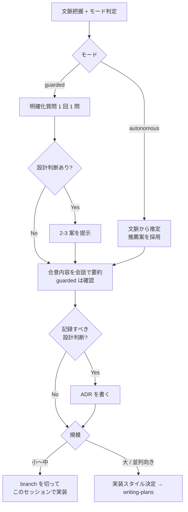

# brainstorming — 意図を揃えて設計判断を下す

実装に入る前に、依頼者と対話して「何を作るか」の解釈を揃え、設計上の選択肢から 1 つを選ぶ。**仕様書 (spec / design doc) は書かない**。文書として残すのは、後から「なぜこうしたか」を問われうる設計判断の **ADR** だけ。

- 意図のすり合わせは会話で完結させる。合意内容をファイルに書き出さない
- 設計判断は ADR に残す。判断が無ければ ADR も書かない

## 前提

実装前に spec を書かせても実装品質は上がらず、コストと時間だけが増えることをベンチマークで確認している (`trapple/sdd-bench`)。このスキルの価値は spec ではなく、(1) 依頼者の頭の中と解釈を揃える対話と、(2) 設計判断の記録にある。

## 使う場面

ユーザーが明示的に呼んだときだけ使う。普段の実装では使わない。

- 依頼の解釈が複数あり、どれを作るかで結果が大きく変わる
- 技術選定・データモデル・境界の切り方など、後から変えにくい設計判断がある
- 規模が大きく、writing-plans で plan を書いてから実装したい

自明な修正や、解釈が 1 つに決まる依頼では使わない。そのまま実装する。

## モード (autonomous / guarded)

着手時に `cross-review` スキル (`~/.claude/skills/cross-review/SKILL.md`) の「モード判定」でモードを決める。**既定は Auto Mode 有効なら autonomous、それ以外は guarded**。ユーザーの「慎重に」「おまかせ」等の発話、PJ の `.claude/rules/autonomy.md`、リスク昇格リストがそれより優先する。

- **guarded**: 質問・選択肢の提示・合意の確認をユーザーと行う
- **autonomous**: 質問で止まらない。文脈から推定し、推薦案を採用して進む。推定した仮定は最終報告 (plan を書く場合は plan の `## 自律判断ログ`) に書く

## 流れ

1. **文脈把握 + モード判定** — 既存ファイル / docs / 直近 commit / 既存 ADR を確認し、モードを宣言する
2. **明確化質問** — 一度に 1 つ。目的 / 制約 / 成功基準を引き出す。**autonomous では質問せず**、コード / docs / user-journey / CLAUDE.md / 依頼文から推定する
3. **選択肢の提示** — 設計判断があるときだけ。2〜3 案をトレードオフと推薦付きで出す。**autonomous では推薦案を採用**する
4. **合意内容の要約** — 何を作るか・受け入れ条件・採用した案を会話の中で短くまとめる。guarded では 1 回で確認を取る。**ファイルには書かない**
5. **ADR を書くか判定し、必要なら書く** (下記「ADR」)
6. **実装へ引き継ぐ** (下記「実装への引き継ぎ」)


```mermaid
flowchart TD
    A[文脈把握 + モード判定] --> MODE{モード}
    MODE -->|guarded| B[明確化質問 1 回 1 問]
    MODE -->|autonomous| AF[文脈から推定<br/>推薦案を採用]
    B --> C{設計判断あり?}
    C -->|Yes| D[2-3 案を提示]
    C -->|No| S
    D --> S[合意内容を会話で要約<br/>guarded は確認]
    AF --> S
    S --> R{記録すべき<br/>設計判断?}
    R -->|Yes| ADR[ADR を書く]
    R -->|No| H
    ADR --> H{規模}
    H -->|小〜中| I[branch を切って<br/>このセッションで実装]
    H -->|大 / 並列向き| W[実装スタイル決定 → writing-plans]
```

## プロセス詳細

### アイデア理解

- まず現状を見る (ファイル / docs / 直近 commit / 既存 ADR)
- 質問する前にスコープを見積もる。「chat + storage + billing + analytics をプラットフォーム化したい」のように複数の独立サブシステムを含む要望は **その場で指摘** し、サブプロジェクトに分解して 1 つずつ進める
- 適切なサイズなら **質問は一度に 1 つ**。選択肢があるなら multiple choice に
- 焦点: 目的 / 制約 / 成功基準
- **autonomous では:** 質問の代わりに推定する。根拠が見つからず、しかも間違えると不可逆な論点だけは cross-review の停止条件に従って止まる

### 選択肢提示

- 2〜3 通りの方向性 + それぞれのトレードオフ
- 推薦案を先頭、理由を添える
- 選択肢が実質 1 つしか無いなら提示しない (形だけの比較をしない)

### 疎結合と明確さを設計に織り込む

- 1 つの責務 / well-defined interface / 単独で理解・テスト可能 な単位にシステムを分割する
- 内部を読まずに用途が分かるか? consumer を壊さず内部を変えられるか? 答えが No なら境界を見直す

### 既存コードベースで作業するとき

- 提案前に既存構造を眺めて従う。既存 ADR の決定に反する案を出すときは、その ADR を名指しして覆す理由を述べる
- 関係ないリファクタは混ぜない

## ADR

### 書くとき / 書かないとき

書くのは、次のどれかに当てはまる設計判断が **実際に下された** とき。

- 2 つ以上の現実的な選択肢を比較して 1 つを選んだ
- 後から変えにくい (データモデル、公開 API、依存ライブラリ、境界の切り方)
- PJ の慣習や既存 ADR から外れる

書かないもの: 機能の仕様・受け入れ条件・タスク分解・実装手順 (それはコードと plan が持つ)。選択肢が 1 つしか無かった判断。

### 置き場所と名前

1. `ls docs/adr/ docs/decisions/ doc/adr/ adr/ 2>/dev/null` で既存の配置を確認し、あればそれに揃える (番号付けと書式も既存に合わせる)
2. 無ければ `docs/adr/NNNN-<kebab-case-title>.md` を作る。`NNNN` は 0001 からの連番

### 書式

```markdown
# NNNN. <決定内容を表す短いタイトル>

- Status: Accepted
- Date: YYYY-MM-DD

## Context

<判断が必要になった状況・制約・前提。依頼の要旨もここに含める>

## Decision

<何を選んだか。1〜3 文>

## Considered Options

- <採用案> — <長所 / 短所>
- <不採用案> — <長所 / 短所、不採用の理由>

## Consequences

<この決定で楽になること・難しくなること・将来見直す条件>
```

- 既存 ADR を覆すときは新しい ADR を書き、旧 ADR の Status を `Superseded by NNNN` に変える (旧 ADR の本文は消さない)
- 規模が大きく、ADR 自体を別の目で見たいときは cross-review の「懐疑的なアーキテクト」視点でレビューしてよい (任意)

### commit

ADR も **main / 既定 branch に直 commit しない**。実装用の branch / worktree を切ってから、その上で commit する (`docs(adr): NNNN <タイトル>`)。実装の commit とは分ける。

## 実装への引き継ぎ

### 小〜中規模: このセッションで実装

`git switch -c <branch>` で branch を切り、合意内容に沿ってそのまま実装する。ADR があれば最初に commit する。

### 大規模・並列向き: 実装スタイルを決めて writing-plans へ

直交 2 軸の組み合わせから 4 択で実装スタイルを決め、branch / worktree を切ってから `writing-plans` を呼ぶ。writing-plans には **依頼文 (逐語)・会話で合意した内容の要約・関連 ADR の path** を渡す。

- **隔離軸**: `worktree` (別ディレクトリで隔離) or `branch` (このセッションで branch だけ切る)
- **並列軸**: `SDD` (subagent-driven-development で並列) or `直列` (このセッションで順に実装)

guarded ではユーザーに 4 択を聞く (AskUserQuestion。tool 利用不可な環境では markdown 表 + 番号付き選択肢で代替)。autonomous では下記「autonomous での機械的決定」で決める。

- **A. worktree + SDD** — 隔離環境 × subagent 駆動。大規模 / 並列向け
- **B. branch + 直列** — branch のみ、このセッションで順に実装。小〜中規模 / 1 本道
- **C. worktree + 直列** — worktree で隔離して直列、subagent なし
- **D. branch + SDD** — branch のみ、このセッションで SDD

#### 軸ごとの判断材料

**隔離 (worktree) を選ぶとき:**
- main で別ブランチ作業を並行で走らせたい
- 破壊的検証 (DB / 外部 API / 大量 rename 等) を main から隔離したい
- SDD と組み合わせて、subagent が main の作業ツリーを汚す問題を避けたい

**branch (現セッションのまま) を選ぶとき:**
- 並行する別作業はない / worktree セットアップのオーバーヘッドを払いたくない
- 既存セッションの context をそのまま実装に引き継ぎたい

**SDD を選ぶとき:**
- タスクが疎結合に分割できる (≥3 並列タスクが見える)

**直列を選ぶとき:**
- タスクが 1 本道 / 共有 state が大きい / 順序依存が強い
- subagent 起動コスト (token / wall-clock) を払う価値がない規模

#### autonomous での機械的決定

- **並列軸**: 互いに順序依存がなく別々に着手・完了できるタスクが 3 つ以上見えるなら `SDD`、それ以外は `直列`
- **隔離軸**: `git status --porcelain` が空でない (main の作業ツリーが汚れている) / 並行作業中の branch・worktree がある / 破壊的検証を伴う → `worktree`。それ以外は `branch`

決まったら:

- **A / C** (worktree あり): `using-git-worktrees` スキルで worktree を準備する
- **B / D** (worktree なし): `git switch -c <branch>` をこのセッションで実行する

## 鍵となる原則

- **質問は 1 回 1 つ** — 複数を一度に投げない
- **選択肢提示が望ましい** — open-ended より answer しやすい
- **YAGNI を貫く** — 不要機能を設計から削る
- **文書は判断だけ** — 合意内容は会話で、設計判断は ADR で。spec は書かない

## 視覚補助 (visual companion)

「文章で書くより図 / 表 / モックを見せた方が早く伝わる質問」が出てきたときだけ、視覚補助を提案する。最初から押し付けない。詳細は `visual-companion.md` を参照 (autonomous では skip)。

視覚補助はテキスト手段に閉じる: Mermaid 図 / Markdown 表 / コードブロックモック / AskUserQuestion の preview。

## プロジェクト固有資産との接続 (あれば使う)

- **`user-journey` スキル**: repo root に `data/user_journey.db` が物理的に存在する PJ でのみ適用。仕様判断のとき過去要件を先に検索して、長期方針との衝突を避ける
- **既存 ADR**: 判断の前に読み、矛盾する場合は Supersede の手順を取る
- **`.claude/rules/autonomy.md`** (モード宣言): あればモード判定に使う
- **`.claude/rules/error-handling.md` (Fail Fast 原則)**: 定義されていれば設計段階でも適用する
- **PJ CLAUDE.md の運用方針**: main 直コミット禁止 / commit message 規約 / ADR 配置規約などを優先する
