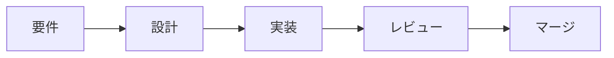

# 視覚補助ガイド

brainstorming 中、文章より図 / 表 / モックの方が伝わる質問があったときの手段集。

## いつ使うか

セッション開始時に「使う / 使わない」を決めるのではなく **質問ごとに判断する**。判定基準:

> ユーザーは「文章で読む」より「絵で見る」方が早く理解できる質問か?

**視覚補助を使う場面 (内容そのものが視覚的):**

- UI モック (ワイヤフレーム / レイアウト / ナビ構造)
- アーキテクチャ図 (コンポーネント / データフロー / 関係マップ)
- 並列比較 (2 つのレイアウト / 配色 / デザイン方向性)
- 仕上げの議論 (見た目 / 余白 / 視覚階層)
- 空間関係 (state machine / フローチャート / ER 図)

**テキストで十分な場面 (内容が言葉 / 表):**

- 要件・スコープ質問 (「X とは何か」「どこまでが対象か」)
- 概念的な A/B/C 選択 (言葉で書ける案の選択)
- トレードオフ列挙 (pros/cons / 比較表は表でよいが「視覚補助」と呼ぶほどではない)
- API / データモデル設計
- 「答えが言葉」になる明確化質問

「UI に関する質問だから視覚補助」ではない。「ウィザードはどんな感じにしたい?」は概念質問 (テキスト)、「このウィザードレイアウトのどれが良い?」は視覚質問 (図)。

## 手段 4 種

視覚補助はテキスト / Markdown ベース。ブラウザサーバや外部ビューア依存は持たない。

### 1. Mermaid 図

状態遷移 / コンポーネント関係 / フローチャートに。



提示時の注意:
- 1 図 1 主題にする (複数のことを 1 図に詰めない)
- ノードラベルは 1〜3 語で
- 矢印に条件があれば `-->|条件| ` で書く

### 2. Markdown 比較表

選択肢 2〜4 個のトレードオフ比較に。

| | 案 A: 雑誌風 | 案 B: ミニマル | 案 C: タイル |
|---|---|---|---|
| 情報密度 | 高 | 低 | 中 |
| 実装コスト | 高 | 低 | 中 |
| 推薦 | △ | ◯ | ◯ |

### 3. ASCII / コードブロックモック

レイアウトの "形" を伝えるのに。pixel-perfect である必要はない。

```
┌─────────────────────────────────────┐
│ Logo │ Home  About  Library  Login  │  ← nav
├─────────────────────────────────────┤
│ ┌─────┐   ┌─────────────────────┐   │
│ │ side│   │  main content       │   │
│ │ nav │   │  (album grid)       │   │
│ │     │   │  ┌──┐ ┌──┐ ┌──┐     │   │
│ │     │   │  │  │ │  │ │  │     │   │
│ │     │   │  └──┘ └──┘ └──┘     │   │
│ └─────┘   └─────────────────────┘   │
└─────────────────────────────────────┘
```

monospace 前提なので等幅で揃える。

### 4. AskUserQuestion の preview field

並列比較したい選択肢が ASCII で表現できる場合、`AskUserQuestion` の `options[].preview` に積むと選択 UI と一緒に見せられる。例: 3 つの状態遷移 (Mermaid 不可なので ASCII で)。

## 適用ルール

- **1 提案 1 メッセージ** — 視覚補助を切り出した場合、そのメッセージは offer / 図のみ。質問本文は混ぜない
- **2〜4 選択肢上限** — それ以上は情報過多
- **fidelity をスケール** — レイアウト議論ならワイヤフレームで十分。色 / 余白の議論まで来てから polish する
- **質問文を図の上に書く** — 「これのどれが良い?」だけだと判断材料が足りない
- **戻れるようにする** — 図を見て要件が変わったら、新しい図を提示してから次の質問に進む

## アンチパターン

- 最初から「視覚補助使いますか?」と聞く (出るまで待つ)
- UI 話題のたびに毎回図を出す (概念質問はテキスト)
- 1 図に複数の意思決定を詰める (1 図 1 主題)
- 解像度ミスマッチ (ワイヤフレーム議論で polish 図、polish 議論でワイヤフレーム)
