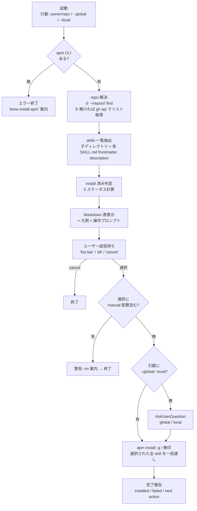

# install-skills — APM 経由で skills を opt-in 導入

APM (Agent Package Manager) で配布された skills repository (デフォルト `trapple/skills`) をブラウズし、必要な skill だけを `apm install` 経由で global (`~/.apm/`) または local (`./apm.yml`) に opt-in 導入する。

**着手の合図:** `install-skills スキルで進めます。` と 1 行宣言してから始める。

## いつ使うか

- ユーザーが「`install-skills`」「`スキル導入`」「`skill install`」「`スキル入れて`」「`apm スキル`」と発話したとき
- グローバル skill を減らして PJ ごとに opt-in 導入したいとき
- どのスキルが既に入っているか / 別 repo 由来同名スキルが衝突していないかを把握したいとき

### 引数仕様

| 形式 | 意味 |
|---|---|
| (引数なし) | `trapple/skills` を一覧 → 対話選択 → install 先 AskUserQuestion |
| `<owner>/<repo>` | 別 repo を一覧 → 対話選択 → install 先 AskUserQuestion |
| `--global` / `-g` | install 先質問を skip して global 固定 |
| `--local` / `-l` | install 先質問を skip して local 固定 |

**skill 名直指定 (`install-skills brainstorming commit`) は受け付けない** — 常に一覧経由。skill 名を覚えていて直接入れたいなら `apm install [-g] <owner>/<repo>/<skill>` を直叩きする方が速い。

引数の順序混在可: `install-skills --global mizchi/skills` も `install-skills mizchi/skills -g` も受け取る。

## 全体フロー



## 手順

以下は順に実行する。途中で失敗した step がある場合は「エラー処理 / Fail Fast」セクションを参照。

### 1. 環境チェック

`apm` CLI が PATH にあることを確認する。

```bash
which apm
```

**OK** (例: `/opt/homebrew/bin/apm` が 1 行出る) → 次の step へ。

**見つからない** (空出力 + exit code 非ゼロ) → 以下のメッセージを表示して **即終了**。自動 install はしない。

```
[x] apm CLI が見つかりません。
インストール:
  brew install apm                          # macOS / Homebrew
  詳細: https://github.com/microsoft/apm
```

### 2. repo 解決

引数で `<owner>/<repo>` が指定されればそれを使い、無ければ `trapple/skills` をデフォルトとする (`--global` / `--local` フラグ単独指定は repo 指定にカウントしない)。

#### 2-1. ローカルクローンを優先して探す

```bash
OWNER=trapple
REPO=skills
REPO_PATH=$(find ~/repos -maxdepth 5 -type d -path "*/${OWNER}/${REPO}" 2>/dev/null | head -1)
echo "${REPO_PATH:-(not found locally)}"
```

ヒットすれば `REPO_PATH` をそのまま skill 列挙に使う (高速 / オフライン耐性)。

#### 2-2. ローカルに無ければ gh api でリスト取得

```bash
gh api "repos/${OWNER}/${REPO}/contents" --jq '.[] | select(.type=="dir") | .name'
```

これで子ディレクトリ名一覧が取れる。各 skill の `SKILL.md` 本体は次の step (3. skills 一覧抽出) で個別 fetch する。

#### 2-3. 解決失敗時 (Fail Fast)

ローカル find が 0 件 **かつ** `gh api` も 404 (or `gh` CLI 不在 / 未認証) なら以下を表示して即終了:

```
[x] repository <owner>/<repo> が見つかりません。
- ローカルクローン (~/repos/**/<owner>/<repo>) が無い
- gh CLI 経由でも fetch できない (404 / gh 未認証 / gh 未インストール)
```

### 3. skills 一覧抽出

`REPO_PATH` 配下の子ディレクトリのうち `SKILL.md` を持つものを skill として列挙する。表示は **辞書順** (frontmatter `name` = ディレクトリ名)。

#### 3-1. skill 名列挙

```bash
ls -1 "$REPO_PATH" | while read d; do
  [ -f "$REPO_PATH/$d/SKILL.md" ] && echo "$d"
done | sort
```

#### 3-2. 各 skill の description / triggers 抽出

各 skill について `SKILL.md` の frontmatter `description` 行を 1 行取り出し、Markdown 表の `Triggers` 列と `Description` 列に使う。

```bash
DESC=$(awk '/^---$/{c++; next} c==1 && /^description:/' "$REPO_PATH/$SKILL/SKILL.md")
```

##### Triggers 列の取り出し方

description には説明文中で `"Why"` `"How"` のような **trigger ではない引用符** が含まれることがある (例: `commit` skill の "Why" / "How")。素朴に全引用符を拾うと混入する。

そこで `Use when user says "X", "Y", or "Z"` 句を優先的に取り、無ければ全引用符 fallback:

```bash
# 優先: Use when user says ... の中の引用符だけ拾う
TRIGGERS=$(echo "$DESC" | grep -oE 'Use when user says[^.]*' | head -1 \
             | grep -oE '"[^"]+"' | head -4)
# fallback: 取れなければ description 内の全引用符
[ -z "$TRIGGERS" ] && TRIGGERS=$(echo "$DESC" | grep -oE '"[^"]+"' | head -4)
TRIGGERS=$(echo "$TRIGGERS" | awk 'NR==1{printf "%s",$0; next} {printf " / %s",$0}')
```

5 件以上ある場合は ` / ...` を末尾に付けて省略。

##### Description 列の取り出し方

`description:` 行の値部分 (引用符内) を取り出し、`Use when user says ...` 以降を除いた前段を 1 文として使う。全角 30〜40 字目安。長すぎる場合も切り詰めず、表が広くなるのは許容する。

```bash
DESC_TEXT=$(echo "$DESC" \
  | sed -E 's/^description: *"//; s/" *$//' \
  | sed -E 's/[. 。]?Use when user says.*$//' \
  | sed -E 's/[. 。]?Use proactively when.*$//')
```

取れない / 空ならそのまま空欄 (placeholder の `?` などは入れない)。

#### 3-3. gh api fallback (REPO_PATH 無し)

```bash
# 子ディレクトリ名一覧
gh api "repos/${OWNER}/${REPO}/contents" --jq '.[] | select(.type=="dir") | .name' | sort

# 各 skill の SKILL.md を fetch (改行されたままの内容、awk に流せる)
gh api "repos/${OWNER}/${REPO}/contents/${SKILL}/SKILL.md" --jq '.content' \
  | base64 -d \
  | awk '/^---$/{c++; next} c==1 && /^description:/'
```

### 4. install 済み status 判定

各 skill について以下 5 種のうち 1 つを決定する。判定は **`<owner>/<repo>/<skill>` 完全一致** で行い、同名でも別 repo 由来は別扱い (= 表上は当該 skill としては未導入 `—`、ただし別途警告ブロックで通知)。

| Status | 条件 |
|---|---|
| `global` | `~/.apm/apm.yml` の `dependencies.apm` に `<owner>/<repo>/<skill>` が含まれる |
| `local` | `<cwd>/apm.yml` (存在すれば) に `<owner>/<repo>/<skill>` が含まれる |
| `both` | global と local 両方ヒット |
| `manual` | 上記いずれもヒットしない + `~/.claude/skills/<skill>/SKILL.md` が物理存在 |
| `—` | いずれも該当なし |

#### 4-1. 判定 one-liner (POSIX 互換、macOS BSD grep でも動く)

```bash
GLOBAL_YAML=~/.apm/apm.yml
LOCAL_YAML=./apm.yml
SKILL_DIR=~/.claude/skills

is_global() {
  [ -f "$GLOBAL_YAML" ] && \
    grep -qE "^[[:space:]]*-[[:space:]]*${OWNER}/${REPO}/$1([[:space:]]*#.*)?$" "$GLOBAL_YAML"
}
is_local() {
  [ -f "$LOCAL_YAML" ] && \
    grep -qE "^[[:space:]]*-[[:space:]]*${OWNER}/${REPO}/$1([[:space:]]*#.*)?$" "$LOCAL_YAML"
}
is_manual() {
  ! is_global "$1" && ! is_local "$1" && [ -f "$SKILL_DIR/$1/SKILL.md" ]
}

status_for() {
  local g l
  is_global "$1" && g=1 || g=0
  is_local  "$1" && l=1 || l=0
  if [ "$g$l" = "11" ]; then echo "both"
  elif [ "$g" = "1" ]; then echo "global"
  elif [ "$l" = "1" ]; then echo "local"
  elif is_manual "$1"; then echo "manual"
  else echo "—"
  fi
}
```

POSIX 文字クラス `[[:space:]]` を使う (Perl 拡張の `\s` は BSD grep で動かない可能性があるため避ける)。

#### 4-2. 別 repo 由来同名 skill 検出 (警告ブロック用)

表とは別に、表の下に出す警告ブロックを作る。`apm.yml` の同名 skill を含む行を `[^/]+/[^/]+/${skill}` でマッチさせ、自 repo のものを除外する。

```bash
foreign_for() {
  local skill=$1 yaml label
  for yaml in "$GLOBAL_YAML" "$LOCAL_YAML"; do
    [ -f "$yaml" ] || continue
    [ "$yaml" = "$GLOBAL_YAML" ] && label=global || label=local
    grep -E "^[[:space:]]*-[[:space:]]*[^/]+/[^/]+/${skill}([[:space:]]*#.*)?$" "$yaml" \
      | grep -v "${OWNER}/${REPO}/${skill}" \
      | sed -E "s|^[[:space:]]*-[[:space:]]*||; s|[[:space:]]*#.*$||" \
      | while read pkg; do echo "  - $skill → $pkg ($label)"; done
  done
}
```

#### 4-3. エッジケース (silent OK、Fail Fast 違反ではない)

| ケース | 扱い |
|---|---|
| `~/.apm/apm.yml` が存在しない | global 判定は全 `—` (0 件ヒットと等価) |
| `<cwd>/apm.yml` が存在しない | local 判定は全 `—` |
| `dependencies.apm:` が `null` / 空 | grep 0 件ヒット → 全 `—` |
| `~/.claude/skills/<name>/` あるが `SKILL.md` 無し | `—` 扱い (壊れた配置として manual には数えない) |

### 5. 一覧表表示 + 選択プロンプト

step 3 / 4 で集めた情報を、以下のレイアウトでユーザーに **1 メッセージで** 提示する。

```
利用可能なスキル: <owner>/<repo> (<REPO_PATH>)

| Skill | Status | Triggers | Description |
|-------|--------|----------|-------------|
| <name1> | <status1> | <triggers1> | <desc1> |
| <name2> | <status2> | <triggers2> | <desc2> |
...

凡例:
  global : ~/.apm/apm.yml に登録済み (全 PJ で使える)
  local  : このディレクトリの ./apm.yml に登録済み
  both   : global と local 両方に登録
  manual : apm 経由でなく ~/.claude/skills/ に物理配置 (apm では管理されていない)
  —      : 未導入

(別 repo 由来同名 skill が検出されたときのみ、ここに警告ブロックを 1 つ挿入)
[!] 以下のスキルは別 repo 経由で apm 登録されています:
  - <skill1> → <別 repo の package id> (<global|local>)
trapple/skills 経由で入れ直すなら、先に `apm uninstall <package id>` してください。

install したいスキル名をスペース区切りで返してください。
  例) "brainstorming commit"
  全部入れる: "all"
  キャンセル: "cancel"
```

#### 5-1. 表のフォーマット制約

- `Skill` 列: ディレクトリ名 (= frontmatter `name`) **辞書順**
- `Status` 列: 4-1 の `status_for` の戻り値 (`global` / `local` / `both` / `manual` / `—`)
- `Triggers` 列: 引用符付きキーワードを ` / ` 区切りで先頭 3-4 件。超過は ` / ...` を付ける
- `Description` 列: 3-2 の `DESC_TEXT` を 1 文 (全角 30-40 字目安、超過しても切り詰めない)

#### 5-2. 警告ブロックの出し方

`foreign_for <skill>` が 1 行以上返した skill だけを集めて、表の下に **1 ブロック** としてまとめる。0 件なら警告ブロック自体を出さない。

#### 5-3. 操作プロンプト

ユーザーがチャットで応答するまで処理を進めない (= ここでブロッキング)。応答パターンは次の step (6. 選択受付) で処理する。

### 6. 選択受付

#### 6-1. 入力の正規化

- スペース / カンマ / 改行 のいずれも区切りとして許容
- 大文字小文字は **区別する** (skill 名は kebab-case 固定)
- 先頭末尾の空白は trim

```bash
SELECTED_RAW=$(echo "$INPUT" | tr ',\n' ' ' | xargs -n1)
mapfile -t SELECTED <<< "$SELECTED_RAW"   # 配列に格納 (空要素は除外)
# 後段の loop は "${SELECTED[@]}" で展開する。
# 裸の $SELECTED は IFS 汚染の影響で word splitting が壊れる環境があるため避ける。
```

#### 6-2. 特殊トークン

| 入力 | 処理 |
|---|---|
| `cancel` (単独) | 副作用なしで終了 (skill を抜ける) |
| `all` (単独) | 全 skill (status `manual` を **自動除外**) を選択。除外件数を informational に 1 行報告: `[i] manual を N 件除外しました: X, Y` |
| 空入力 | 「skill 名を入力してください (`cancel` で抜ける)」と再プロンプト |
| 不明な skill 名混入 | 「以下のスキルが見つかりません: foo, bar。再入力してください (`cancel` で抜ける)」と再プロンプト |
| 全て有効 | `SELECTED` リストを次の step (7. manual 警告) へ渡す |

#### 6-3. all と manual の関係 (重要)

`all` のとき manual を自動除外する semantic は、「**明示的に選んでいない skill を上書き install する事故を避ける**」ため。除外は黙ってやらず、必ず informational として件数 + 名前を表示する。

```
[i] manual を 2 件除外しました: brainstorming, empirical-prompt-tuning
```

(`all` ではなく **個別選択で manual を明示した場合のみ** 後段で警告 + 終了する。step 7 参照。)

#### 6-4. 再プロンプト時の挙動

再プロンプト時は元の一覧表 (step 5 の出力) は **再掲しない** (画面が縦に長くなりすぎる)。エラーメッセージ + 入力プロンプト 1 行だけ出す。

### 7. manual 配置検出時の警告 (個別選択で manual を明示した場合のみ)

`all` で manual が自動除外されている場合はここに来ない (step 6 で除外済み)。**個別選択で manual を明示した場合のみ**、上書き衝突防止のため以下のフローに入る。

#### 7-1. 検出

```bash
MANUAL_IN_SELECTION=()
for s in "${SELECTED[@]}"; do
  [ "$(status_for "$s")" = "manual" ] && MANUAL_IN_SELECTION+=("$s")
done
```

#### 7-2. 警告 (1 件以上検出時) → 即終了

`MANUAL_IN_SELECTION` が空でなければ以下を表示し、`apm install` は実行せず終了:

```
[!] 以下のスキルは ~/.claude/skills/ に手動配置されています:
  - <skill1>
  - <skill2>
apm 経由で入れ直すには、一度物理削除してから本スキルを再実行してください:
  rm -rf ~/.claude/skills/<skill1> ~/.claude/skills/<skill2>
  /install-skills        # もう一度

選択を取り消して終了します。
```

manual を含まないものだけで進めたい場合は、ユーザーが再実行時に manual を選ばなければ OK。

#### 7-3. 0 件なら次の step (8. install 先選択) へ

### 8. install 先選択

引数で `--global` / `-g` または `--local` / `-l` が指定されていれば AskUserQuestion を skip。なければ AskUserQuestion で確認する (バッチ全体で 1 回、混在不可)。

#### 8-1. 引数による skip 判定

```bash
case " $ARGS " in
  *" --global "*|*" -g "*) INSTALL_FLAG="-g"; SKIP_ASK=1 ;;
  *" --local "*|*" -l "*)  INSTALL_FLAG="";   SKIP_ASK=1 ;;
  *)                       INSTALL_FLAG="";   SKIP_ASK=0 ;;
esac
```

引数順序は混在可: `--global mizchi/skills` も `mizchi/skills -g` も同じ結果。

#### 8-2. AskUserQuestion (SKIP_ASK=0 のときのみ)

```
Q: 選択したスキルの install 先は?
- global (~/.apm/, 全 PJ で使える) — マシン横断ツール (commit / brainstorming など) ならこちら
- local (現 PJ の ./apm.yml に追加) — PJ 固有規約 (TDD 強制したい PJ など) ならこちら
```

- `multiSelect: false`
- `global` を選んだら `INSTALL_FLAG="-g"`、`local` を選んだら `INSTALL_FLAG=""`
- 「混在したい」 (一部 global 一部 local) は **未サポート** — 2 回起動してもらう

#### 8-3. local 選択時の apm.yml 未生成について

`<cwd>/apm.yml` が存在しなくても本スキルは何もしない。`apm install` (無印) 実行時に APM 自身が必要なら自動生成する。

### 9. apm install 実行

#### 9-1. コマンド組み立て

```bash
PKGS=()
for s in "${SELECTED[@]}"; do
  PKGS+=("${OWNER}/${REPO}/$s")
done
# 例: PKGS=(trapple/skills/brainstorming trapple/skills/commit)
```

#### 9-2. 実行

```bash
# global の場合
apm install $INSTALL_FLAG "${PKGS[@]}"
# = apm install -g trapple/skills/brainstorming trapple/skills/commit

# local の場合 (INSTALL_FLAG が空)
apm install "${PKGS[@]}"
```

`$INSTALL_FLAG` は quote しない (空文字のときに引数として渡されないように — quote すると空文字列が 1 引数として残る)。`PKGS` は配列展開で安全に渡す。

#### 9-3. exit code ハンドリング (Fail Fast)

```bash
apm install $INSTALL_FLAG "${PKGS[@]}"
rc=$?
if [ $rc -ne 0 ]; then
  # step 10 (完了報告) の失敗フォーマットへ
  exit $rc
fi
```

- exit 0 → step 10 (成功フォーマット) へ
- exit 非 0 → stderr をそのまま転載 + `apm audit` 推奨を添えて終了

stderr は **改変せず** 転載する (silent skip 禁止、原因切り分けに必要)。

### 10. 完了報告

#### 10-1. 成功時 (rc=0)

```
✓ install 完了 (<global|local>, <N> 件):
  - <owner>/<repo>/<skill1>
  - <owner>/<repo>/<skill2>
  ...

次のアクション候補:
  - `apm list` で登録一覧を確認
  - 新 skill のキーワードで起動して動作確認 (description 内の trigger word)
  - 不要になったら `apm uninstall <owner>/<repo>/<skill>`
```

#### 10-2. 失敗時 (rc != 0)

```
[x] install 失敗 (apm 側エラー):

<apm の stderr をそのまま転載>

[!] apm.yml の状態を `apm audit` で確認することを推奨します。
```

## エラー処理 / Fail Fast

silent skip は禁止。以下のいずれの段階でも、失敗を握りつぶさず原因をそのままユーザーに見せて終了する。

| 段階 | 失敗時 | 該当 step |
|---|---|---|
| apm CLI 不在 | エラー終了 + `brew install apm` 案内 | 1. 環境チェック |
| repo 解決失敗 (ローカル無し + `gh api` 404) | エラー終了 + 原因表示 (ローカル / gh / 認証 / 404 を列挙) | 2. repo 解決 |
| 一覧抽出が 0 件 | 警告 + 終了 (`no skills found in <owner>/<repo>`) | 3. skills 一覧抽出 |
| ユーザー応答が `cancel` | 副作用なしで終了 | 6. 選択受付 |
| ユーザー応答に typo / 不明 skill 名 | 再プロンプト (`cancel` で抜ける) | 6. 選択受付 |
| 選択に manual を **明示含む** (個別選択) | install 実行せず警告 + 終了 | 7. manual 警告 |
| `apm install` exit code != 0 | stderr 転載 + `apm audit` 推奨 + 終了 | 9 / 10 |

### 局所例外 (silent OK)

- `~/.apm/apm.yml` / `<cwd>/apm.yml` が **存在しない** ケースは「未導入とみなす (`—`)」が正しい semantic。0 件ヒットと等価で silent skip ではない (= Fail Fast 違反にあたらない)

## 関連スキル

- **`sync-skill`** — 別 PJ の skill を skills repo に取り込む (install-skills の **逆方向** = 配布側)
- **`init-rules`** — ルールテンプレート (Fail-Fast / docs / plan 出力先 等) を PJ の `.claude/rules/` に導入
- **`create-skill`** — ゼロから新規 skill を scaffold
- **APM 直叩きで済むケース**:
  - `apm install -g <owner>/<repo>/<skill>` — skill 名がわかっていて直接入れたい
  - `apm uninstall <owner>/<repo>/<skill>` — 削除
  - `apm update` — まとめて latest 化
  - `apm list` — 登録一覧
  - `apm audit` — Unicode スキャン + ドリフト検出

install-skills は「**一覧 → 選択 → status 確認 → install 先 1 回確認**」の対話体験を提供する薄いラッパー。pin-point install / バージョン指定 / アンインストール / 更新は本スキルの責務ではない (= 直叩きの方が速い)。

