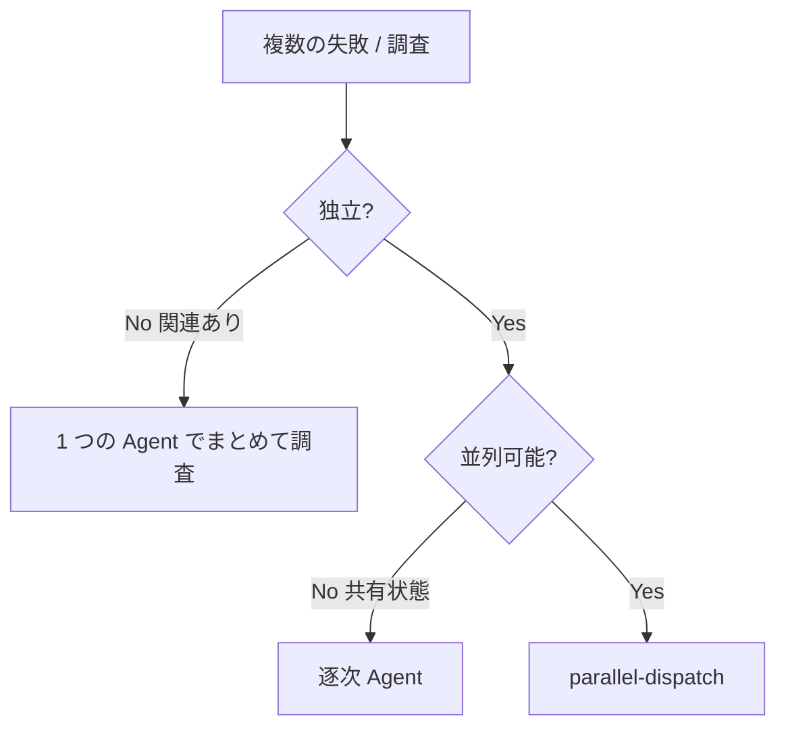

# parallel-dispatch — 独立タスクを並列発注

**薄い版**。独立した N 個の問題ドメインを Agent 並列発注して結果を統合する。1 つの response で複数 Agent 起動 = 並列、1 response 1 Agent = 逐次。

実装 + レビューの 2 段サブエージェントが要るなら `subagent-driven-development` スキル (重い版) を使うこと。こちらは「並列で投げる」だけ。

**着手の合図:** `parallel-dispatch スキルで <N> 件の独立タスクを並列発注します。` と 1 行宣言してから始める。

## Core principle

問題が独立しているなら、context を分けて並列に解かせる方が速い。自分の context も汚れない。

## いつ使うか



**使う:**
- 3 つ以上のテストファイルが別原因で失敗
- 複数サブシステムが独立に壊れている
- 他の結果が無くても各問題が理解できる
- 共有状態が無い

**使わない:**
- 失敗が関連 (1 つ直すと他も直りそう)
- 全体像を理解しないと判断できない
- Agent 同士が干渉する (同じファイルを編集など)

## パターン

### 1. 独立ドメインを特定

「何が壊れているか」でグループ化する:

- File A test: ツール承認フロー
- File B test: バッチ完了挙動
- File C test: abort 機能

ツール承認 fix は abort には影響しない → 独立。

### 2. 各 Agent のタスクを絞る

各 Agent に渡すもの:

- **狭いスコープ:** 1 ファイル / 1 サブシステム
- **明確なゴール:** これらのテストを通せ
- **制約:** 他のコードを触るな
- **期待する返り:** 何を見つけて何を直したかの summary

### 3. 1 メッセージで並列発注

複数の `Agent` tool call を **同じ assistant 応答内** に並べる。

```
<Agent>: "agent-tool-abort.test.mjs の 3 件 fail を直す"
<Agent>: "batch-completion-behavior.test.mjs の 2 件 fail を直す"
<Agent>: "tool-approval-race-conditions.test.mjs の 1 件 fail を直す"
↑ 3 つ同じ response 内に並べる = 並列実行
```

**1 response 1 tool call = 逐次** になるので注意。

**subagent_type の default:** 並列ディスパッチでは fresh の `general-purpose` を使う。各 Agent は独立 context で動かしたいので fork は基本不要 (fork は親 context を引き継ぐので並列化のメリットが薄れる)。親の context を継いだ上で別軸を掘らせたいなど明確な理由があるときだけ fork。

### 4. 結果統合

各 Agent から返ってきたら:

- summary を読む
- 修正が衝突していないか確認 (同じファイルを編集していたら要 merge)
- フルテスト suite を走らせて全体 green を確認
- 全て統合

## Agent prompt の作り方

良い prompt は:

1. **focused** — 1 つの問題ドメイン
2. **self-contained** — 必要な context を全て込み
3. **output が明確** — 何を返してほしいか
4. **モードを明示** — 下記の (a) / (b) どちらか

### モード: 実装モード / 調査モード

並列発注のタスクは大別して 2 つ。Agent prompt 内で明示すること。

- **(a) 実装モード** — fix / 修正までやらせる。期待する返り = root cause + 変更ファイル + 変更 summary + test 結果 (green 確認)。例: テスト fail を直す、bug を修正する
- **(b) 調査モード** — root cause hypothesis までで止める (production コード変更禁止)。期待する返り = 仮説 (優先度順) + 根拠 file:line + 計測 / 静的解析 + 推奨 fix 案 (effort/impact)。例: パフォーマンス調査、原因究明

調査モードでは Agent prompt に明示的に「production コード変更は禁止 (調査のみ)」と書く。混同すると Agent が勝手に修正を始める / 逆に直してほしいのに調査で止まる。

### Agent prompt 必須項目チェックリスト

各 Agent prompt は下表をモード別に埋める。書き漏れは Agent の暴走 / スコープ侵食 / 期待値退化を生む。

| 項目 | 実装モード | 調査モード |
|---|---|---|
| 触ってよいファイル / NG ファイル | 必須明示 | 必須明示 |
| 読み取り範囲 | 対象ファイル + 直接 import 1 hop が default。広げるなら hop 数を prompt 内で指定 | 同左 |
| 触ってよい変更タイプ | production code 修正 OK / テスト 修正は最小限 | 一時 log・テスト追加・profiler 計装は OK / production code 変更は NG |
| テスト実行コマンド | 自スコープに絞ったもの (monorepo なら `pnpm --filter X` 等)。フル test suite は親の統合 phase でのみ | (該当なし。計測スクリプト指示があれば prompt に書く) |
| 期待値退化禁止 | 「テストを通すために assertion / 期待値を緩めるのは禁止。期待値の更新は schema 等の正当な変更が裏付けにある場合のみ」と明記 | (該当なし) |
| 期待する返り | root cause + 変更ファイル + 変更 summary + test 結果 (green 確認) | 仮説 (優先度順) + 根拠 file:line + 計測 / 静的解析 + 推奨 fix 案 (effort/impact) + 追加で必要な計測 |

`1 hop` の根拠: 並列 Agent の読み取りが推移閉包まで広がると隣接 Agent と読み取り overlap し、結果の独立性 (= 並列化の前提) が薄れる。広げる場合は意図的に指定する。

調査モードの例:

```markdown
src/api/user_endpoint.ts の 800ms レイテンシ原因を調査して (修正は禁止):

ハンドラのフローを読み、レイテンシ要因の仮説を 3-5 つ出し、それぞれの根拠を file:line で示す。可能なら既存ログ / tracing から ms オーダーで寄与を推定。最後に effort/impact 付きで改善案を 1-3 個提案。

スコープ: 対象ファイルとその直接呼び出し先のみ。他レイヤー (`src/db/`, `src/frontend/`) は触らない / 読まない。

返り: Root cause hypotheses (file:line 根拠) / Measurement evidence / Recommended fixes (effort S/M/L, impact ms)。
```

実装モードの例:

```markdown
agent-tool-abort.test.mjs の 3 件 fail を直す:

1. "should abort tool with partial output capture" — message に 'interrupted at' を期待
2. "should handle mixed completed and aborted tools" — fast tool が completed ではなく aborted になる
3. "should properly track pendingToolCount" — 3 results 期待だが 0

これは timing / race condition 系。タスク:

1. test ファイルを読んで、各 test が何を verify するか把握
2. root cause を特定: timing 問題か実バグか
3. fix:
   - 任意 timeout を event-based wait に置き換え
   - abort 実装に bug があれば fix
   - 振る舞いが変わったテストなら期待を調整

**timeout を伸ばすだけの fix は禁止。real issue を特定すること。**

返り: 見つけたもの + 直したものの summary。
```

## よくあるミス

| 悪い | 良い |
|------|------|
| 「全テスト直して」 | 「`xxx.test.mjs` を直して」 |
| context なし | エラーメッセージ + test 名を貼る |
| 制約なし (大規模リファクタされる) | 「production code は触るな」 |
| 「直して」 | 「root cause + 変更 summary を返せ」 |

## 使わないとき

- **関連 fail:** まず一緒に調査
- **全体 context が必要:** Agent では分割しすぎる
- **探索デバッグ:** 何が壊れているか分かっていない
- **共有状態:** Agent 同士が同じファイル / リソースで競合する

## 例 (汎用シナリオ)

**シナリオ:** 1 度の refactor で 3 つの独立 lib test が fail

**失敗:**
- `lib-a/parser.test.mjs`: 2 件 (config 差し替えポイントが壊れた)
- `lib-b/formatter.test.mjs`: 1 件 (新 output schema を fixture が反映していない)
- `lib-c/cache.test.mjs`: 2 件 (key 比較が大文字小文字を吸収しなくなった)

**判断:** 各 lib は独立。parser fix が cache の比較ロジックに影響しない。

**発注 (1 メッセージ内に 3 Agent):**

```
Agent: lib-a/parser の config 差し替えポイント fix
Agent: lib-b/formatter の新 schema fixture 更新
Agent: lib-c/cache の大文字小文字比較 fix
```

**結果統合:**

- 各 Agent の summary を読む
- PJ 標準の test runner で全体 green 確認
- conflict があれば merge
- 該当 commit を別々に切る (異なる Why なら別 commit、`commit` スキル参照)

## 検証

Agent 帰還後:

1. **各 summary をレビュー** — 何が変わったか把握
2. **conflict チェック** — 同じコードを Agent が触ったか
3. **フルテスト** — 統合で全部通るか
4. **spot check** — Agent は systematic に間違うことがある (同じ思考で全部見落とすなど)

## 関連スキル / PJ 規約との接続

- **subagent-driven-development** — 実装 + レビューを 2 段に分けたい場合の重い版
- **PJ の test 実行コマンド** — Agent prompt に明示する (`npm test` / `pytest` / `cargo test` / `make test` 等)。長時間 / TUI なら別ペイン / 別 surface での実行ルールを PJ 規約から拾って指示
- **PJ の Fail Fast 系ルール** — PJ CLAUDE.md / `.claude/rules/` に Fail Fast / error-handling 規約 (silent skip / try-catch して続行 禁止) があれば、Agent prompt に「silent skip で失敗を隠す fix は禁止」と明示
- **ドメイン固有の罠 (CJK 正規化、API クライアント、共有 mutable state など)** — その fix を扱う Agent には、関連節 (CLAUDE.md / docs/) を context として渡す
