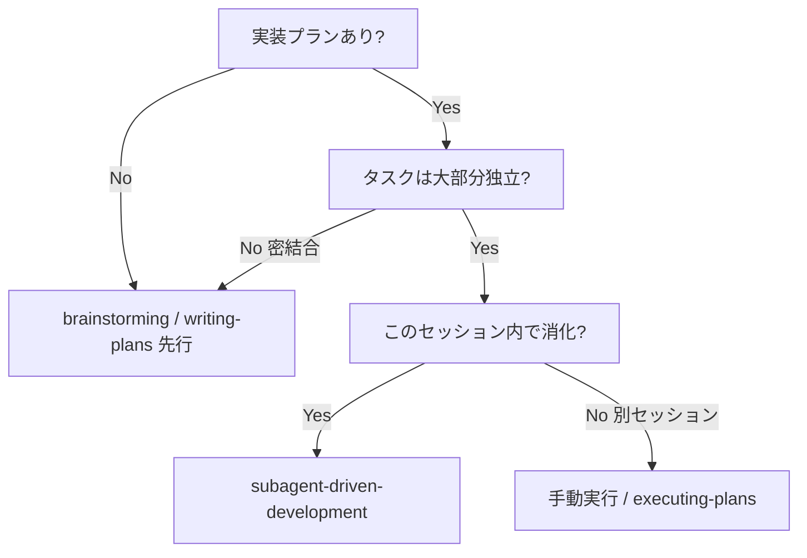
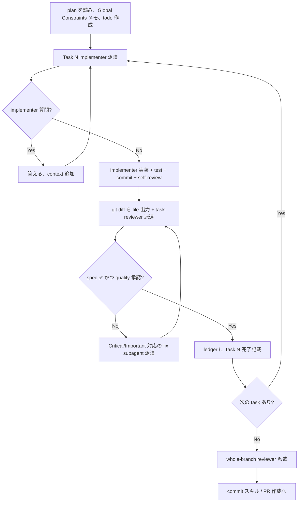

# subagent-driven-development — Subagent 駆動でプランを消化

`writing-plans` で書いた実装プランを、**タスクごとに fresh implementer subagent** を派遣して消化する。各タスク完了後に **task reviewer subagent** (spec 適合 + コード品質) を回し、全タスク終了後に **whole-branch reviewer** を 1 回回す。

**Why subagent:** 1 タスクごとに必要な context を controller が選んで渡す → subagent は session 履歴を引き継がない → 集中して succeed する。controller 側の context も coordination 用に温存される。

**Core principle:** fresh subagent per task + task review (spec + quality) + final broad review = 高品質 + 高速反復

**ナレーション:** tool call 間で語るのは最小限。ledger と tool result が記録を持つ。

**連続実行:** タスク間でユーザーに「続けていい?」と聞かない。BLOCKED が解けない / 真の曖昧さ / 全タスク完了 以外では止まらない。進捗 summary もタスクごとに出さない。**実行を頼まれたら実行する**。

**着手の合図:** `subagent-driven-development でこの plan を消化します。` と 1 行宣言してから始める。

## いつ使うか



**手動実行との違い:**
- 同セッション (context switch なし)
- fresh subagent per task (context pollution なし)
- 各 task で spec + quality review、最後に whole-branch review
- 高速反復 (タスク間に human-in-loop なし)

## 全体フロー



## Pre-flight: plan の事前 review

Task 1 派遣前に 1 度だけ plan を scan:

- タスク同士が矛盾していないか
- plan が明示的に要求しているものが review 規約 (assertion なしテスト、ロジック逐語複製 等) で defect 扱いされないか
- **下流伝播チェック**: Task 1 だけでなく **後続 task が前提にしている既存 file / global pattern / 既存 infra** (例: 「既存 login route」「既存 express middleware パターン」) が repo に **実在するか**。実在しないなら下流 task 着手時にもう一度ユーザー判断が必要になるので、ここで一緒に列挙して 1 質問にまとめる

見つけたら **まとめて 1 質問でユーザーに提示** (各 finding と plan の該当箇所を並べて「どちらが govern するか」)。実行開始後に途中で割り込ませない。clean なら無言で進む。

**Auto Mode 等の外部 directive との関係:** 「clarifying question を避ける」「reasonable call で進む」のような外部 directive が session に効いていても、**pre-flight finding はその抑制の対象外** — clarifying question ではなく adjudication request として扱い、batched question を発火する。理由: pre-flight は「実行開始前の plan vs 規約の整合」を確認する process gate であり、後で割り込ませない代わりに先で集約する設計上の必須ステップ。Auto Mode を盾に skip すると、SDD の他の不可逆行動 (commit / 派遣) が plan-mandated defect に汚染される。

**Compaction 後 resume での再 pre-flight:** ledger に「Task N: complete」が並んでいて Task N+1 から再開する場合も、**次 task が前提とする既存物の実在チェック (下流伝播)** を必ず 1 度走らせる。理由: 初回 pre-flight 時点では「Task N が後で作る」前提で finding をクリアしていた可能性があるが、ledger の途中 commit 後に当時の前提が崩れていることが現実にある。`ls` / `grep` で 1 分以内に終わるので skip しない。

## モデル選択

各役割に **必要十分な最小コスト** のモデルを選ぶ。

| 役割 | モデル目安 |
|------|-----------|
| 機械的実装 (1〜2 ファイル、spec が完全) | 安いモデル |
| 統合実装 (複数ファイル、パターン照合、デバッグ) | 標準モデル |
| 設計判断、コードベース全体把握が必要 | 高能力モデル |
| task reviewer (小さい diff) | 標準モデル |
| task reviewer (concurrency / 微妙な変更) | 高能力モデル |
| **whole-branch final reviewer** | **高能力モデル** |

**Agent dispatch では model を明示する**。省略すると session の (高い) 親モデルを継承して silent に高コスト化する。

**turn 数 > token price.** 安いモデルは多段 task で turn が 2-3 倍に膨れて結局高くつく。floor は中堅モデル。「plan に完全な code が書いてある transcription + test 系」だけ最安に。

## implementer status の扱い

implementer subagent は 4 status のいずれかで返る:

**DONE:** review package を作って task-reviewer を派遣する:

```bash
BASE=<task 開始前の commit>  # ledger に記録済み
HEAD=$(git rev-parse HEAD)
DIFF_FILE=".claude/sdd/diff-task-$N.txt"
{
  echo "## commits"
  git log --oneline "$BASE..$HEAD"
  echo ""
  echo "## stat"
  git diff --stat "$BASE..$HEAD"
  echo ""
  echo "## diff"
  git diff -U10 "$BASE..$HEAD"
} > "$DIFF_FILE"
```

**重要:** `BASE` は task 派遣前に記録した SHA を使う。`HEAD~1` だと multi-commit な task で先頭以外を silent に落とす。

**DONE_WITH_CONCERNS:** 完了したが懸念あり。concerns を読んで判断:
- 正しさ / scope の話なら review 前に対応
- 観察 (「このファイルが肥大化してきた」等) ならメモして review へ

**NEEDS_CONTEXT:** 必要な情報が無かった。context 補って再派遣。

**BLOCKED:** 完了不能。原因別:
1. context 不足 → 補って同モデルで再派遣
2. reasoning 不足 → 上位モデルで再派遣
3. task が大きすぎる → 分割
4. plan 自体が間違い → ユーザーに escalate

**絶対やらない:** escalation を無視 / 何も変えずに同モデルで retry。「stuck」と言われたら何かを変える。

## reviewer の ⚠️ 項目の扱い

task reviewer は「⚠️ Cannot verify from diff」を返すことがある (要件が unchanged code に in、または task をまたぐ)。これは review を block しないが、**controller 自身で resolve する**。controller は plan / 他 task の context を持っていて reviewer は持っていない。real gap だと判定したら spec failure 扱い → implementer に戻して再 review。

## reviewer prompt を組み立てるとき

task review は task-scoped gate。broad review は最後の whole-branch review でやる。reviewer template を埋めるときの NG:

- 「他の使用箇所も全部見て」のような task-specific 理由が無い open-ended 指示
- implementer が既に走らせた test を「もう一度走らせて」と頼む (報告の test evidence で十分)
- 「これは false positive だから flag するな」「at most Minor で」「plan がそう要求しているから OK」など **事前に finding を pre-judge する文言**。reviewer に flag させて、review loop で adjudicate する
- Global Constraints block: plan / spec から **逐語的に** コピー。値・format・コンポーネント間の関係 ("X と同じ layout", "Y に match") を含む。process 規約は template が持っているので constraints block は「この案件の spec が要求するもの」専用
- diff は file で渡す (上の DONE 節の `DIFF_FILE`)。pasted text は controller の context に居続けて compaction で消えるのを待つコストがかかる
- dispatch prompt は 1 task の話。過去 task の summary を貼らない (実例で 99% が pasted history だった事故あり)。fresh subagent には「自分の task + 触る interfaces + Global Constraints」だけ
- Critical / Important は fix subagent で対応。Minor は ledger に記録 → final whole-branch reviewer に triage させる
- plan-mandated finding (plan が明示的に要求しているが review 規約では defect) はユーザーに「finding と plan 該当箇所」を並べて聞く。plan を盾に dismiss しない、plan と矛盾する fix を勝手に投げない
- whole-branch review にも diff package を渡す: `BASE=$(git merge-base main HEAD)`, `HEAD=current`、同じ format で 1 file に
- fix dispatch にも implementer 契約: covering test を再実行、command + 結果を report file に追記。reviewer は走らせ直さない
- whole-branch review で複数 finding が返ったら **ONE fix subagent** にまとめて投げる。1 finding 1 fixer は context 再構築コストが finding 数だけ嵩む

## file handoff

dispatch prompt に貼り付けたもの・subagent が print したものは **session 全体の context に残る**。compaction まで読み直される。大型 artifact は **file 渡し**:

- **task brief:** plan ファイルから該当 task の全文を抽出して `.claude/sdd/task-$N-brief.md` に書き出し、dispatch prompt に **path** だけ書く

  ```bash
  # plan ファイルの実 path は PJ 規約 / writing-plans 出力先による
  # (例: .claude/plans/<plan>.md または docs/plans/<plan>.md)
  PLAN_FILE="<plan ファイルの実 path>"
  sed -n "/^### Task $N/,/^### Task $((N+1))/p" "$PLAN_FILE" > .claude/sdd/task-$N-brief.md
  ```

  dispatch prompt は 5 要素のみ:
  1. このプロジェクト内での位置 (1 行)
  2. brief path: 「これを先に読め。あなたの requirements、値は逐語的に使う」
  3. 前 task の interface / 決定 (brief に書けていないもの)
  4. brief で気になった曖昧さに対する controller の resolution。**以下は brief が黙っているなら必ずここで埋める** (resolved として書くか、明示的に「implementer に着手前に質問させる」と書く):
     - **インフラ初期化の許可範囲**: package.json / build runner / test runner / 新規依存 install を今 task で許可するか、許可するなら最大範囲はどこか (例: 「最小構成で `npm init -y` + jsonwebtoken + jest のみ可、他 dep 追加は BLOCKED」)。fresh repo / 不足インフラで特に必須。
     - **brief が前提とする既存ファイル / 既存 signature の存在確認結果**: controller が事前に `ls` / `grep` で確認し、無ければ「無いので新規作成」「無いので BLOCKED」のどちらかを明示。implementer に推測させない。
     - **例外 throw / Fail Fast の発火タイミング**: import 時 / 呼び出し時 / 中間レイヤなど、Global Constraints の Fail Fast を「いつ」発火させるか。判断点が複数あるなら controller が選んで pin。
  5. report file path + report 契約

  数値 / magic string / signature / test case は brief だけに置く。

- **report file:** brief と対にして `.claude/sdd/task-$N-report.md` を path で渡す。implementer はフルレポートをそこに書き、controller には status + commit + 1 行 test summary + concern だけ返す

- **reviewer 入力 3 file:** brief / report / diff package + Global Constraints

- **fix dispatch:** 同じ report file に fix report (test 結果込み) を append。re-review は更新後の file を読む

## 永続的な進捗 ledger

conversation 履歴は compaction で消える。**完了した task を再派遣してしまう** のは実セッションで観測された最大のミス。**ledger file で track する**。

```bash
LEDGER=".claude/sdd/progress.md"
mkdir -p .claude/sdd
```

- skill 開始時に ledger を確認: `cat .claude/sdd/progress.md`。complete とある task は **DONE** — 再派遣しない、最初に未完の task から resume
- task review が clean に通った瞬間、他の bookkeeping と同じメッセージで append:
  ```
  Task N: complete (commits <base7>..<head7>, review clean)
  ```
- ledger は recovery map。compaction 後、自分の記憶 < ledger + git log
- `git clean -fdx` は ledger を消す (ledger は .gitignore 対象、scratch 扱い)。消えたら git log から復元

## prompt template

- [implementer.md](implementer.md) — implementer subagent 派遣 prompt
- [reviewer.md](reviewer.md) — task reviewer subagent 派遣 prompt
- whole-branch final review: 同じ reviewer.md を MERGE_BASE..HEAD の diff で 1 回

## ワークフロー例

```
[plan を 1 度読む]
[全 task の todo 作成]
[ledger 確認 — 空]

Task 1: Hook installation スクリプト

[task-brief を file 化]
[task 開始前 SHA を BASE として記録]
[implementer 派遣 (model: 標準)、prompt は 5 要素 + brief path + report path]

implementer: 「hook の install 先は user level か system level か?」

controller: 「user level (~/.config/<project>/hooks/)」

implementer: 「了解、実装します...」
[後] implementer:
  - Status: DONE
  - commits: a1b2c3d feat: install-hook
  - 5/5 tests passing, output pristine
  - 詳細は .claude/sdd/task-1-report.md

[diff file を生成、task-reviewer 派遣]
reviewer: Spec ✅ — 要件全部満たし、余計な extra なし。Strengths: テスト網羅、clean。Issues: なし。Task quality: Approved.

[ledger に append: "Task 1: complete (commits 1234567..a1b2c3d, review clean)"]
[todo Task 1 完了]

Task 2: ...
```

## Red Flags

**やってはいけない:**

- ユーザー同意なしに main / master 上で開始
- task review を skip / 2 つの verdict (spec + quality) のどちらか欠けた report で完了扱い
- 未 fix の Critical/Important を残して次へ
- implementer subagent を **複数並列** で派遣 (同じ working tree で衝突する。並列なら worktree isolation か parallel-dispatch スキル)
- subagent に plan ファイル全文を読ませる (brief を渡す)
- task の position / fit を伝えない (subagent はどこの話か分からない)
- subagent の質問を無視
- spec 適合を "close enough" で OK にする (reviewer が spec issue を見つけた = 未完)
- reviewer に「これは flag するな」「Minor 以下扱いで」と pre-judge を仕込む
- diff file 無しで reviewer を派遣
- whole-branch review に複数の per-finding fixer を投げる (1 つの fix subagent でまとめる)
- ledger に complete とある task を再派遣

**implementer が質問した:** 明確に答える + 必要 context を補う。急かさない。

**reviewer が issue を出した:** 同じ implementer subagent で fix → 再 review。re-review を skip しない。

**implementer が失敗した:** 手で fix しない (controller の context が汚れる)。fix subagent を別途派遣。

## 関連スキル

- **using-git-worktrees** — 隔離 workspace を先に確保 (`.claude/worktrees/<branch>/`)
- **writing-plans** — このスキルが消化する plan の作成元
- **test-driven-development** — subagent が各 task で適用する
- **commit** — 全 task 終了後の最終 commit / PR 作成は既存 `commit` スキルで
- **PJ の Fail Fast 系ルール** — PJ CLAUDE.md / `.claude/rules/` に Fail Fast や error-handling の規約 (silent skip 禁止 等) があれば、それを Global Constraints に **常に** 含めること

## ledger / brief / report の保存先

- 全部 `.claude/sdd/` 配下 (.gitignore 対象として運用)
- `.gitignore` に未追加なら最初に追記:
  ```bash
  grep -q "^.claude/sdd/" .gitignore || { echo ".claude/sdd/" >> .gitignore && git add .gitignore && git commit -m "chore: ignore .claude/sdd/"; }
  ```
- 構成:
  ```
  .claude/sdd/
    progress.md          ← ledger
    task-1-brief.md
    task-1-report.md
    diff-task-1.txt
    task-2-brief.md
    ...
  ```
