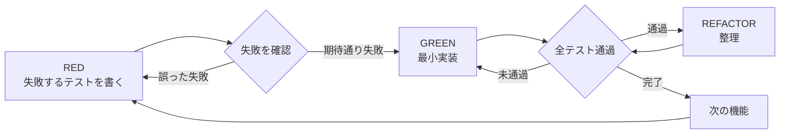

# test-driven-development — テスト先行

テスト → 失敗確認 → 最小実装 → 通過確認 → リファクタ、を強制する。

**Core principle:** **失敗を見てないテストは、正しいものをテストしているか分からない**。

**第二原則:** **テストは必要十分に**。spec の各振る舞いをちょうど 1 回ずつ — 多いほど良い、ではない (下記「必要十分 — 過剰テストの禁止」)。

**着手の合図:** `test-driven-development スキルで進めます。` と 1 行宣言してから始める。

**規則の字面を破ることは、規則の精神を破ることと同じ。**

## いつ使うか

**常に:**
- 新機能
- bug fix
- リファクタ
- 振る舞いの変更

**例外 (ユーザーに確認してから):**
- 使い捨て試作
- 生成コード
- 設定ファイル

「今回だけ TDD は飛ばす」と思ったら 止まる。それは合理化。

## The Iron Law

```
失敗するテスト無しで production code を書くな
```

テストより先に書いたコード → **delete**。やり直す。

**例外なし:**
- 「参考用に残す」NG
- 「テスト書きながら adapt する」NG
- 「見るだけ」NG
- delete は delete

テストから新鮮に実装する。以上。

**適用対象 (誤解しやすい点):** Iron Law の delete 規則は **この cycle で新規追加する production code** に対するもの。**既存コードの bug fix は対象外** (失敗する再現テスト → 最小 patch で OK、既存コードを delete する必要はない)。詳細は下記「例: bug fix」と「デバッグとの統合」参照。

## Red-Green-Refactor



### RED — 失敗するテストを書く

**1 つの振る舞い** を **明確な名前** で **実コードに対して** テストする。

良い例 (node:test):

```javascript
import { test } from 'node:test';
import assert from 'node:assert/strict';
import { retryOperation } from '../src/retry.mjs';

test('retries failed operations 3 times', async () => {
  let attempts = 0;
  const operation = async () => {
    attempts++;
    if (attempts < 3) throw new Error('fail');
    return 'success';
  };

  const result = await retryOperation(operation);

  assert.equal(result, 'success');
  assert.equal(attempts, 3);
});
```

悪い例 (mock 中心):

```javascript
test('retry works', async () => {
  const mock = jest.fn()
    .mockRejectedValueOnce(new Error())
    .mockRejectedValueOnce(new Error())
    .mockResolvedValueOnce('success');
  await retryOperation(mock);
  expect(mock).toHaveBeenCalledTimes(3);
});
```

→ 名前が漠然、mock の振る舞いをテストしていてコードをテストしていない。

**要件:**
- 1 つの振る舞い
- 明確な名前
- 実コード (mock は避けられないときだけ)

### Verify RED — 失敗を見る (必須)

**省略禁止。**

PJ 標準のテストコマンドで実行する (例: `npm test` / `pytest` / `cargo test` / `go test ./...` / `make test`)。長時間 / 出力を後から見たい / 常駐 watch の場合は、PJ のコマンド実行ルール (例: `.claude/rules/cmux-command-execution.md` 等の別ペイン規約) に従う。

```bash
# 例: Node プロジェクト
node --test tests/retry.test.mjs
```

確認:
- **fail** している (error ではなく)
- **fail メッセージが期待通り** ("retryOperation is not defined" / "expected 'success', got undefined" 等)
- **機能が無いから fail** している (typo で fail しているのではない)

**pass している?** → 下記「RED が観測できなかったときの判別フロー」へ。短絡的にテストを直すと regression coverage まで消す可能性があるので、まず原因を 3 パターンに分ける。

**error している?** → 同じ判別フローのパターン C / D を参照。test setup error と production crash で対応が分かれる。

### RED が観測できなかったときの判別フロー

テストを書いて実行したが期待した assertion fail が出ない場合、以下のいずれか。**Red Flags の「テストが即 pass した」はパターン A-1 のみが該当** — パターン A-2 / A-3 / C / D は正当な観測手順。

**A. 即 pass した** (期待: fail / 実際: pass)

- **A-1. 既存の振る舞いをテストしている** (= 既存 test と重複、または書き間違いで現状を assert している) → そのテストを delete もしくは正しい振る舞いに書き直す
- **A-2. 別 cycle の最小汎用実装で先取り pass している** (例: chunk の cycle 1 で slice ループを書いた → cycle 2「last chunk が短い」が即 pass。chunk の cycle 1 で literal 値を返す fake it → cycle 2 で triangulation を起こすか選択) → **そのまま regression coverage として残す**。trace に「Verify RED は cycle N で済んでいる」と 1 行記録すれば OK。delete しない
- **A-3. 新規振る舞いが現行実装で偶然成立している** (例: `await` の throw 自然伝播 / 副作用ゼロ no-op / 既存 default 値が偶然正解) → **production を一時的に「逆向き」に振る舞わせて RED を強制観測** → 元に戻して GREEN 再確認。trace に「forced break で RED 観測」と記録。これも valid。手法は 2 つ:
  - **A-3a. negation 注入**: 既存ロジックに 1 行突っ込む (`throw new Error('intentional RED')` / 既存 return 値を反転 / 条件を `!` で反転)。「既存コードを書き換える」型
  - **A-3b. counterfactual injection**: 「振る舞いを成立させているのが **コードの absence**」(catch がない / 包んでいる try がない / fallback がない) のとき、**あえて壊す wrapper を一時的に追加 → 観測 → 削除**。例: `await` の throw 自然伝播をテストする場合、production を一時的に `try { ... } catch { return null; }` で包んで suppress → RED 観測 → wrapper 削除して GREEN 再確認

**B. fake it vs triangulation の選択** (A-2 の派生)

- **fake it**: cycle 1 で literal を返す (例: `return [[1,2],[3,4]]`) → cycle 2 で別データ点を試し、triangulation で汎用化を強制
- **triangulation 不要 (汎用最小)**: cycle 1 で最小汎用実装を直接書く。後続 cycle が即 pass しても A-2 として残す

どちらでも OK。1 PJ / 1 spec の中では一貫させる。「先に書く実装の粒度を最小にしすぎて 50 cycle 必要になった」「逆に最初から汎用にして spec 漏れの test ケースを足し忘れた」はどちらも不良。spec のデータ点数 (3〜5 件) で fake it、データ点数 (10+) で汎用最小、を目安とする

**C. test setup error** (import 失敗 / typo / module 解決失敗)

→ error の原因を直して再実行。fail を観測するまでが RED

- **特例: import 先 module が未作成** (`ERR_MODULE_NOT_FOUND` 等) → 対象 symbol の **空 stub** (`export function name() {}` / `export const name = undefined;` 等) を作って module 解決を通す。**空 stub は assertion を pass させる能力がないため Iron Law の "production code" には該当しない** (空 stub 作成 ≠ 「テスト前に実装を書いた」)。次の実行で assertion fail まで到達する

**D. assert に到達せず runner が crash / OOM / timeout** (production 側の無限ループ / null deref など)

→ **production 側の欠落機能 / バグが原因なら valid な RED とみなす**。2 sub-case:

- **D-1. crash が「今 cycle のテスト対象 behavior の欠落」そのもの** (例: 「size=0 で TypeError」をテストしたら guard 未実装ゆえに無限ループ) → crash 自体を valid RED として記録。次の edit (= guard 実装) がそのまま GREEN。**「最小 guard を一時挿入 → 観測 → 本実装」の二段は不要、1 edit で完結してよい**
- **D-2. crash が今 cycle のテスト対象 behavior と incidental** (例: 別 path の null deref がたまたま当該 test の setup 段階で発火し、本来見たい assertion まで届かない) → production に最小 guard (loop 上限 / early return / null check) を入れて assertion メッセージまで到達させてから記録する方が望ましい (後続の Verify GREEN との対称性のため)

### GREEN — 最小実装

テストを通す最小のコード。

良い例:

```javascript
export async function retryOperation(fn) {
  for (let i = 0; i < 3; i++) {
    try {
      return await fn();
    } catch (e) {
      if (i === 2) throw e;
    }
  }
}
```

悪い例 (YAGNI 違反):

```javascript
export async function retryOperation(fn, options = {}) {
  const { maxRetries = 3, backoff = 'exponential', onRetry } = options;
  // ...大量の未要求機能
}
```

機能を足すな。他コードのリファクタするな。テストを超えた "改善" もするな。

### Verify GREEN — 通過を見る (必須)

```bash
node --test tests/retry.test.mjs
```

確認:
- 該当テストが pass
- **他のテストも通過したまま**
- 出力が pristine (warning / error が混じっていない) — **ただし pristine 要件は「最終 Verify GREEN」に対して**。A-3 forced break / D-1 crash 観測など意図的な失敗実行の出力には適用しない

**テストが fail?** コードを直す (テストを緩めるな)。
**他テストが fail?** いま直す。あとでは無理。

### REFACTOR — 整理する

GREEN 後だけ:
- 重複を除く
- 名前を改善する
- ヘルパー関数を抽出する

テストは green を保つ。振る舞いは追加しない。

### 次へ

次の機能の RED から繰り返す。

## 良いテストの基準

| 観点 | 良い | 悪い |
|------|------|------|
| **最小** | 1 つの振る舞い。"and" が入ったら分割 | `test('validates email and domain and whitespace')` |
| **明確** | 名前が振る舞いを説明する | `test('test1')`, `test('works')` |
| **意図** | 望ましい API を示す | コードがどう動くか曖昧 |
| **必要十分** | spec の 1 振る舞い = 1 テスト | 同一分岐を入力違いで水増し |
| **KISS** | setup 数行 + 実行 + assert でベタ書き | テスト内に分岐 / ループ / 過剰な helper |

## 必要十分 — 過剰テストの禁止

「テスト先行」は「テストを多く書け」ではない。テストも保守対象のコード。冗長なテストは regression 検出力を上げず、refactor のコストとノイズだけを増やす。

**テストを 1 本足す前のゲート:**

```
このテストが fail するような production の変更は、spec 違反か?
  Yes → 書く
  No (振る舞い不変の refactor で壊れる / 既存テストと同じ変更でしか壊れない) → 書かない
```

**書かないもの:**

| 対象 | 理由 |
|------|------|
| 言語 / framework / library 自体の動作 | 自分のコードではない (`JSON.parse` が動く証明は不要) |
| 同一 equivalence class の重複入力 | 代表 1 点 (+ spec に意味のある境界値) で証明として十分 |
| 実装詳細 (内部 helper の呼び出し回数 / 順序) | refactor で壊れる。public な振る舞い経由で assert する |
| spec に無い hypothetical 入力への防御 | YAGNI。spec が増えたときに RED から書く |
| private 関数の直接テスト | public API 経由で cover されるならそれで十分 |

**テストコード自体も KISS:**

- setup 数行 + 実行 1 行 + assert 数行、で読み切れる形が正。ベタ書きでよい
- テスト内に if / try-catch での成否分岐を書かない。分岐したくなったら別テストに分割
- table-driven / パラメタ化は境界値の列挙にだけ使う。同一 class の水増しに使わない
- setup が肥大したら helper 追加より先に設計を疑う (「スタックしたとき」参照)

**増やす方向の合理化:**

| 言い訳 | 現実 |
|--------|------|
| 「テストは多いほど安全」 | 冗長テストは検出力を上げない。refactor 阻害とノイズが増えるだけ |
| 「念のため全パターン」 | equivalence class の代表 + 境界で証明は完結する |
| 「カバレッジ 100% が目標」 | カバレッジは結果であって目標ではない。目標は spec の振る舞い網羅 |

**逆方向の合理化に注意:** spec にある振る舞い・境界・エラー経路を「過剰」と呼んで省くのは Iron Law 違反。必要十分 = **spec の全振る舞いを、それぞれちょうど 1 回ずつ**。

## よくある合理化と現実

| 言い訳 | 現実 |
|--------|------|
| 「単純すぎてテスト不要」 | 単純コードでも壊れる。テスト 30 秒。 |
| 「あとでテスト書く」 | あとで書いたテストは即 pass = 何も証明しない |
| 「テスト先後で目的は同じ」 | 後 = 「何をするか」、先 = 「何をすべきか」。違う |
| 「手で動作確認した」 | ad-hoc は systematic にあらず。記録も再現もできない |
| 「X 時間捨てるのは無駄」 | 捨ててもサンクコスト。「テスト無しコード保持」が技術的負債 |
| 「参考に残して、テスト先行で書く」 | adapt する = テスト後追い。delete = delete |
| 「探索後にテスト書く」 | 探索 OK。捨ててから TDD で書き直す |
| 「テストが難しい = 設計が複雑」 | テストの声を聞け。テスト困難 = 使用困難 |
| 「TDD で遅くなる」 | TDD はデバッグより速い。pragmatic = テスト先行 |
| 「手動の方が速い」 | 手動は edge case を証明しない。毎回再テスト |
| 「既存コードに test がない」 | 触るなら直す。既存コードにも test を追加 |

**いずれの言い訳も同じ結論: コードを delete して TDD でやり直す。**

## Red Flags

以下が出たら止まってやり直す:

- テストの前にコードを書いた
- 実装後にテストを書いた
- テストが即 pass した (※「Verify RED の判別フロー」A-1 のみが該当。A-2 重複先取り / A-3 偶然成立 / D runner crash は valid な観測なので除外)
- なぜ fail したか説明できない
- 「あとで」テストを書く
- 「今回だけ」と合理化
- 「精神は同じ、形式は違うだけ」
- 「参考に残す」「adapt する」
- 「X 時間捨てるのは無駄」
- 「TDD は dogmatic、自分は pragmatic」
- 「これは特別な case」

## 例: bug fix

**Bug:** 空 email を accept してしまう

**RED**

```javascript
test('rejects empty email', async () => {
  const result = await submitForm({ email: '' });
  assert.equal(result.error, 'Email required');
});
```

**Verify RED**

```bash
node --test tests/form.test.mjs
# FAIL: expected 'Email required', got undefined
```

**GREEN**

```javascript
export function submitForm(data) {
  if (!data.email?.trim()) {
    return { error: 'Email required' };
  }
  // ...
}
```

**Verify GREEN**

```bash
node --test tests/form.test.mjs
# PASS
```

**REFACTOR**: 他フィールドも増えそうなら validation を抽出。

## 完了前チェックリスト

work 完了マーク前に:

- [ ] 新規 / 変更した関数すべてに test がある
- [ ] 各 test の **fail を見た** あとで実装した
- [ ] 各 test は **期待した理由で fail** した (機能が無いから / typo ではなく)
- [ ] 通過のため最小コードを書いた
- [ ] 全 test pass
- [ ] 出力が pristine (warning / error 無し)
- [ ] mock は避けられない箇所だけ
- [ ] spec 上ありうる edge case / エラー経路を cover した (spec 外の hypothetical は書かない)
- [ ] 冗長テストが無い — 同一 equivalence class の重複 / 実装詳細 / library 自体のテストをしていない (「必要十分」参照)

**全部 ✓ じゃない = TDD を飛ばした。やり直す。**

## スタックしたとき

| 症状 | 対応 |
|------|------|
| テストの書き方が分からない | 望む API を「こう呼べたら」で書く。assertion 先。それでもダメなら聞く |
| テストが複雑すぎる | 設計が複雑。interface を簡略化 |
| mock 多すぎ | 結合度が高い。dependency injection で疎にする |
| setup が巨大 | helper 抽出。それでもダメなら設計を見直す |

## デバッグとの統合

bug を見つけたら **まず bug を再現する failing test** を書く。TDD cycle に乗せる。テストが fix の証明と regression 防止の両方になる。

**test なしで bug 修正しない。**

## テスト anti-pattern (頻出 3 種)

### 1. mock の振る舞いをテストしている

```javascript
// 悪い: mock の呼ばれ方を assert している
expect(mock).toHaveBeenCalledWith(...);
```

```javascript
// 良い: real な値を作って結果を assert
const result = await fn(realInput);
assert.equal(result, expected);
```

mock は外部依存 (network, fs, time) を切るためだけに使う。production code の挙動の代わりに mock の挙動をテストしない。

### 2. test-only な method を production class に追加

「test しやすいように」と production 側に `__testOnly_reset()` 等を生やすのは禁止。dependency injection で外から差し替えられるようにする。

### 3. 依存を理解せず mock する

「とりあえず mock しておけば pass する」で書くと、production で何が起きるか保証されない。mock するなら **production 実装と同じ contract** を mock 側でも満たす (or 差し替え可能な小さい interface に切り出す)。

不完全な mock / 後付け test / 過剰 mock / 過剰テストなど他の anti-pattern と詳細な gate function は [testing-anti-patterns.md](testing-anti-patterns.md) 参照。

## PJ 規約との接続

- **Fail Fast 原則** (PJ CLAUDE.md / `.claude/rules/error-handling.md` 等に定義があれば): silent skip / fallback で続行しない設計を testing でも貫く。テストでも catch して empty を返すような assertion は NG
- **コマンド実行ルール** (PJ CLAUDE.md / `.claude/rules/cmux-command-execution.md` 等に定義があれば): test 実行が長時間 / TUI / watch の場合は別ペイン / 別 surface 規約に従う
- **副作用は引数注入で mock 可能に**: DB / 外部 API / fs などの副作用は引数で渡し、test 側で stub を差せるようにする。PJ で確立した DI パターンがあればそれに合わせる

## 最終 rule

```
production code → test が存在し、先に fail していた
それ以外 → TDD ではない
```

例外はユーザーの明示的許可があるときだけ。
